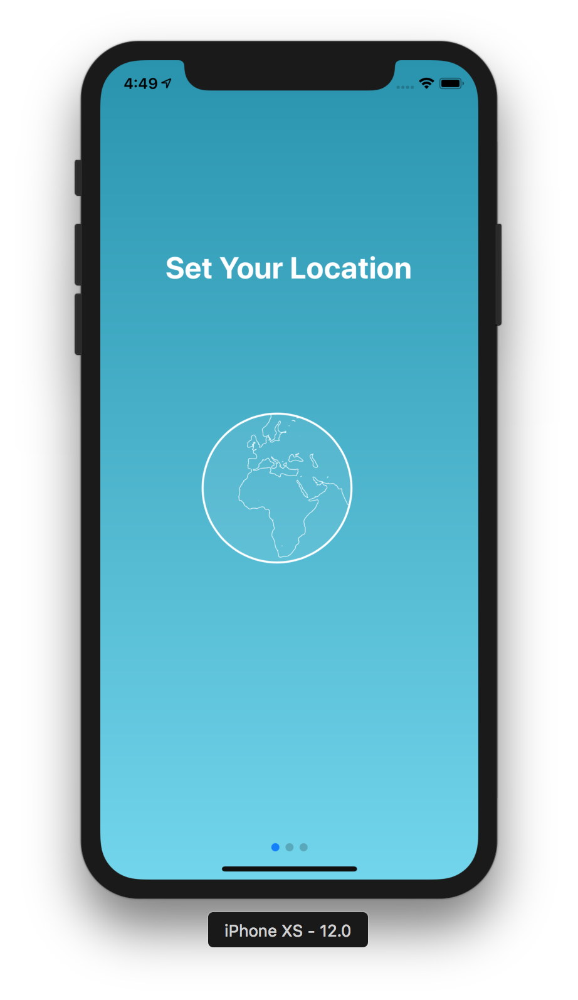
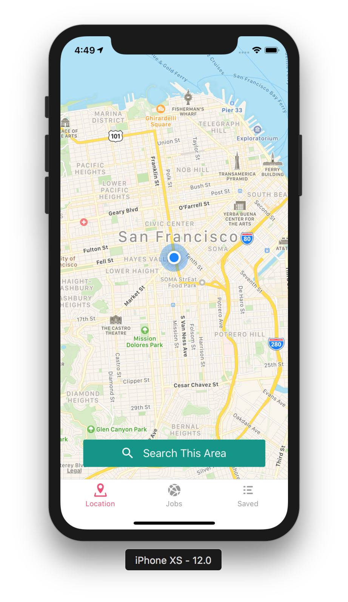
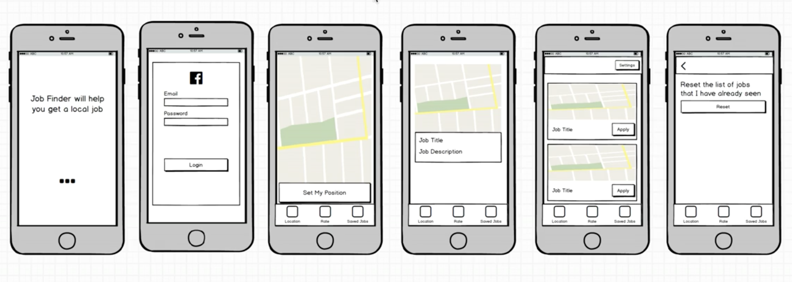

# Jobs mobile app
Following advanced Udemy [React Native: Advanced Concepts course](https://www.udemy.com/react-native-advanced/learn/v4/overview)

## Main Goal
Creating an awesome app that helps you find jobs near you.


### [Demo - Try it on Expo](https://expo.io/@jkhusanov/jobs-mobile)

## Demo, screenshots, coming soon
<!-- <div style={{display: flex; flex-direction: row}}>
  
  
</div> -->


## Getting started, with app client

```
git clone https://github.com/jkhusanov/jobs-mobile.git

exp start

exp ios
```


## TODO

- [x] Implement **Navigation**
- [x] Integrate  **Facebook login**
- [x] Redux setup
- [x] Finish auth flow with adding skip button
- [x] Map add to the Location screen
- [x] Make API call to **GitHub Jobs** and store them in Redux
- [ ] Import  **Swipe** component and style it
- [ ] Attach the screenshots/gif of screens to `README.MD`

## Wireframes and project plan


<div style={{display: flex; flex-direction: row}}>
  
  <p></p>
</div>


