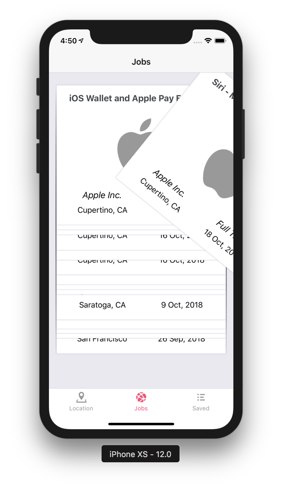
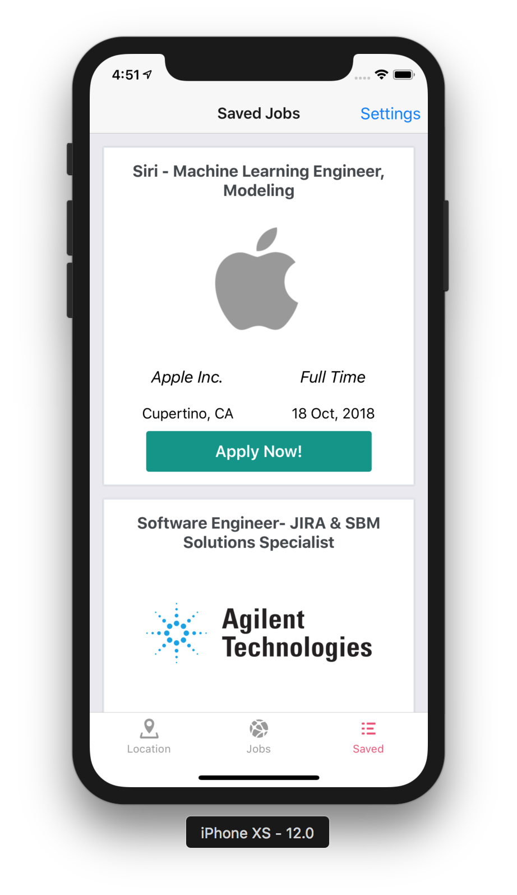
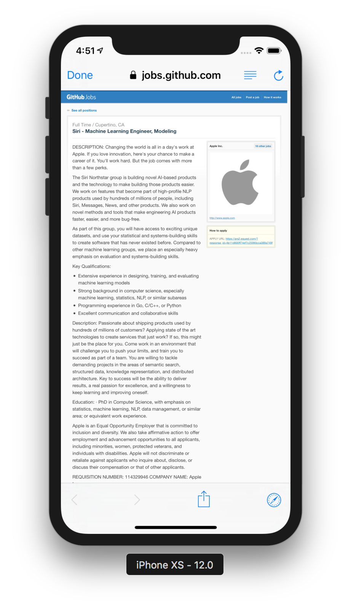
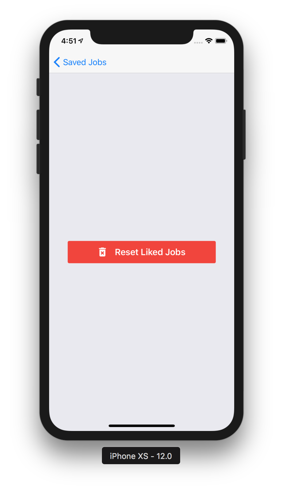
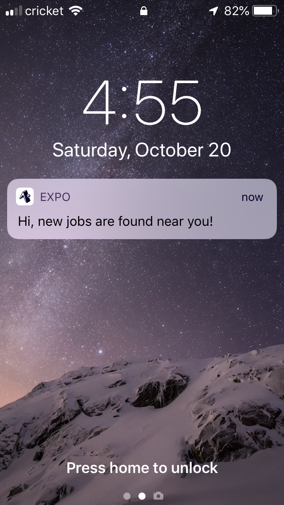

# Jobs mobile app
Following advanced Udemy [React Native: Advanced Concepts course](https://www.udemy.com/react-native-advanced/learn/v4/overview)

## Main Goal
What do you do when you're looking for a job? Well, you can create an awesome app that helps you find jobs near you 😄 Just let the app know your location and then it will find tech jobs in that location. Uses [GitHub Jobs](https://jobs.github.com/api) to find jobs. State management and data storage are handled with Redux and Redux Persist. 


### [Demo - Try it on Expo](https://expo.io/@jkhusanov/jobs-mobile)

## Demo, screenshots, coming soon


<div style={{display: flex; flex-direction: row}}>
  
  
  
  
  
  
  
</div>


## Getting started, with app client

```
git clone https://github.com/jkhusanov/jobs-mobile.git

expo start

expo ios
```

## Tech Stack

* React Native
* React Native Elements
* Expo
* Axios
* lodash
* React Navigation
* React Native Swiper
* Redux
* Redux Persist

## TODO

- [x] Implement **Navigation**
- [x] Integrate  **Facebook login**
- [x] Redux setup
- [x] Finish auth flow with adding skip button
- [x] Map add to the Location screen
- [x] Make API call to **GitHub Jobs** and store them in Redux
- [x] Import  **Swipe** component and style it
- [x] Add reducers for liked jobs and show them on **Saved** screen
- [x] Implement Apply for jobs feature
- [x] Save jobs locally/offline with **Redux Persist**
- [x] **Push Notifications** for updates
- [x] Try **Lottie** [animations](https://github.com/react-community/lottie-react-native) on intro screen
- [x] UI polish such as time and date for jobs
- [x] Find jobs based on current location on initial launch
- [x] Attach the screenshots/gif of screens to `README.MD`

## Wireframes and project plan


<div style={{display: flex; flex-direction: row}}>
  
  <p></p>
</div>


